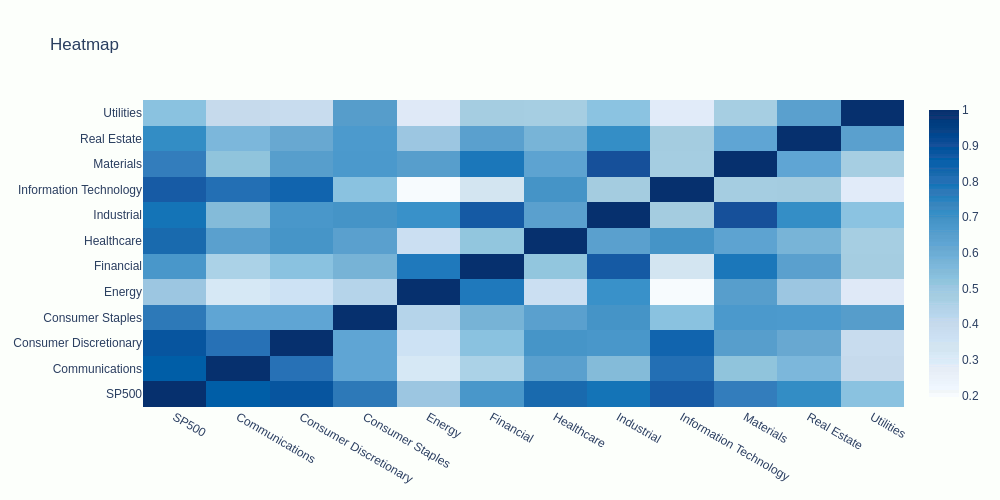
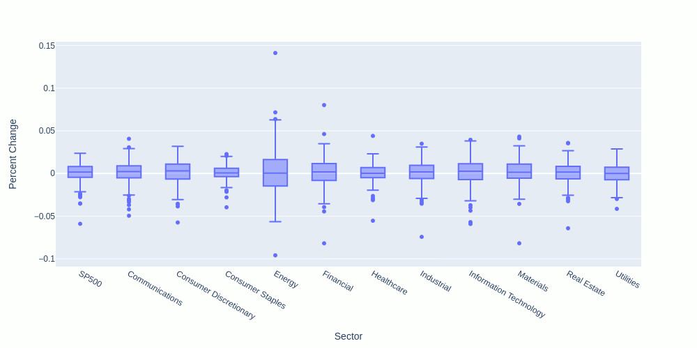
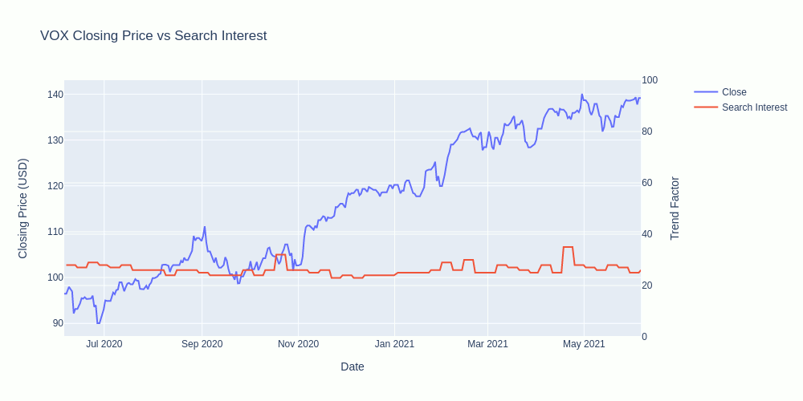
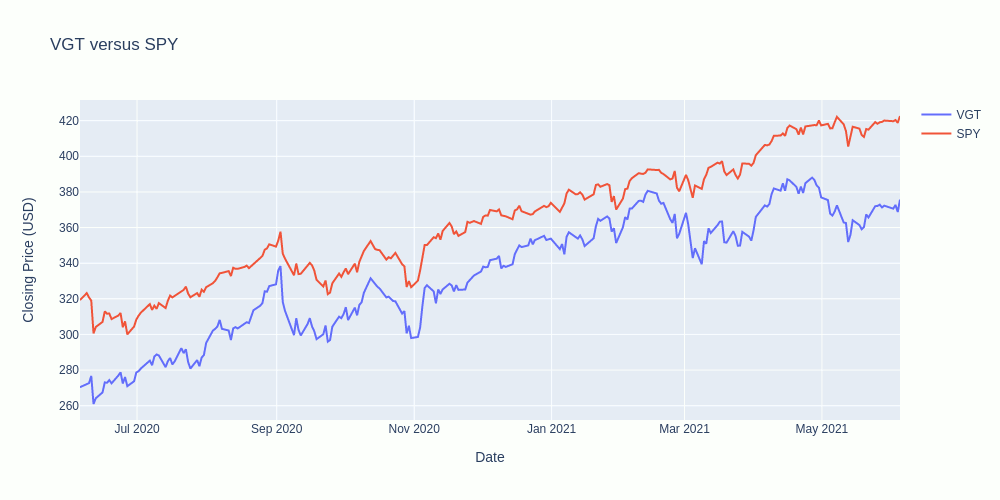
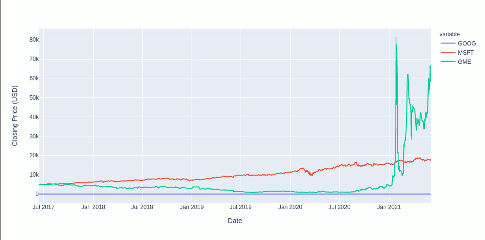
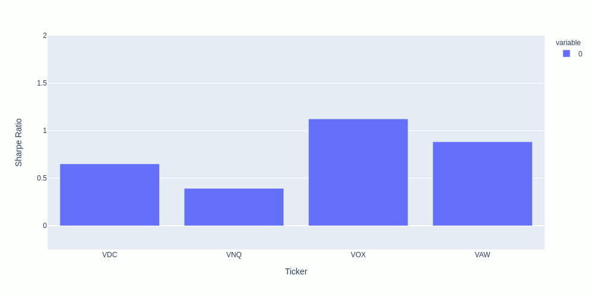

# 🐍📈 Project 1 - Group 4 📉🐍

### Members
* Mouhamadou Lmine Diop aka 🎮 Pro Gamer 🕹️
* Josh Ferguson aka 🦅 Proud Patriot 🇺🇸
* Ben McCright aka 👴 Boomer 👴 
* Cole Wood aka 💎 Diamond Hands 👐

### Introduction
Online trading makes investing in the stock market more accessible than ever before, but how do you know what to invest in?  You could spend your money on professoinal advice, you could spend your time researching stocks and monitoring the market, but a lot of people just invest in whatever is trending on social media.

This project explores the 11 different sectors of the S & P 500 index, comparing them in different ways with the goal of being a quick reference for people who want to do their own research before investing.  We started by finding the minimum, median, and maximum beta-values in each sector, along with a mutual fund.  For comparison we use the index itself and a tradeable fund (ticker: SPY).

Here's what we learned:

Correlation is proportional with beta value, the mutual fund correlated the most.

The biggest outlier was in the Healthcare sector.

There can be correlation between search interest and closing price.

Candlestick charts are an excellent indicator of volatility.  A longer candle means more variance in price.

The SPY fund outperforms nearly all of the stocks we surveyed.

The earlier you enter the market, the more potential you have for growth.

Meme stocks may be more volatile, but they have much more potential for growth in the short term.  You have to spend a lot of time monitoring them in order to know when to buy/sell.

### Conclusion
The people who invest based on social media trends might hit it big occasionally, but they are dependent on personalities that may or may not have good intentions.  You don't have to spend a lot of money on professional advice or have a degree in economics to make smart investment choices.  Think about your financial goals and your appetite for risk, do your research and you will be more likely to have an enjoyable investment experience.  So when your friends ask you about your investments, you might not be able to give them a detailed technical analysis, but hopefully you'll be able to tell them the most important thing:
LINE GO UP!

### References
* [Plotly Express](https://plotly.com/python/plotly-express/)
* [Plotly Graph Objects in Python](https://plotly.com/python/graph-objects/)
* [Panel for Python](https://panel.holoviz.org/)
* [Google Trends API for Python](https://pypi.org/project/pytrends/)
* [Alpaca Trading API](https://alpaca.markets/docs/)
* [SPY Fund](https://www.ssga.com/us/en/institutional/etfs/funds/spdr-sp-500-etf-trust-spy)
